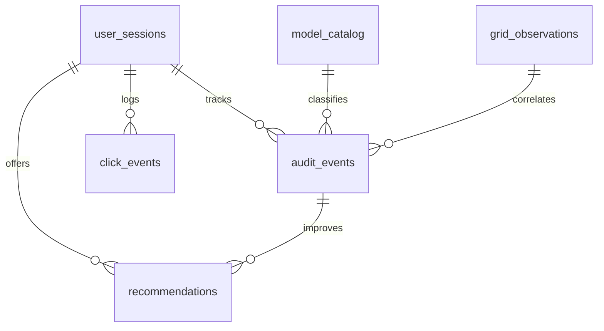
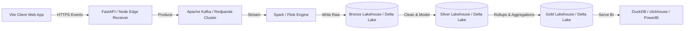

# GDPR-Conscious Analytics Database Design for EcoPulse

This document outlines the architecture, relational schema, privacy constraints, and future data engineering scaling roadmap for **EcoPulse's** analytics database. 

The schema is tailored for analytics engineering (dbt compatibility, star-schema modeling, and dashboard reporting) while strictly adhering to GDPR privacy-by-design standards.

---

## 1. Database Architecture Overview

The database acts as a **sustainability telemetry store** to capture anonymous user interactions, carbon audit observations, and UK electrical grid fluctuations.



### Privacy Boundaries (PII vs. Non-PII)

> [!IMPORTANT]
> **GDPR-Conscious Data Restrictions**
> To satisfy GDPR compliance without complex user consent requirements, the database enforces a strict separation:
> - **We DO Store**: Token estimates, model types, broad regional IDs (e.g. UK National/London), browser device categories, feature clicks, and estimated energy draw (Wh/ml/mg).
> - **We DO NOT Store**: Raw text prompts, uploaded file contents, file attachments, images, voice logs, names, email addresses, exact IP addresses, or tracking tokens.

---

## 2. Table Specifications

### A. Reference Dimensions

#### `model_catalog`
Contains model engine parameters and hardware depletion assumptions.

| Column | Type | Description |
| :--- | :--- | :--- |
| `model_id` (PK) | `VARCHAR(50)` | Unique model slug (e.g., `gpt-4-opus`) |
| `model_name` | `VARCHAR(100)` | User-facing model name |
| `provider` | `VARCHAR(100)` | Provider entity (e.g., `Anthropic`) |
| `model_size` | `VARCHAR(20)` | Size category (`Small`, `Medium`, `Large`, `Extra Large`) |
| `kwh_per_1k_tokens` | `NUMERIC(10, 6)` | Energy draw factor (kWh / 1000 tokens) |
| `water_ml_per_1k_tokens` | `NUMERIC(10, 4)` | Fresh water server-cooling factor |
| `ewaste_mg_per_1k_tokens` | `NUMERIC(10, 4)` | GPU hardware depletion factor |
| `suitability_tags` | `VARCHAR(50)[]` | Array of tags describing ideal workloads for this model |
| `created_at` | `TIMESTAMP` | Timestamp when entry was added (UTC) |
| `updated_at` | `TIMESTAMP` | Timestamp of last catalog modification (UTC) |

---

### B. Transactional Facts

#### `user_sessions`
Monitors session activity anonymously to isolate session length and savings tallies.

| Column | Type | Description |
| :--- | :--- | :--- |
| `session_id` (PK) | `UUID` | Auto-generated session tracking ID |
| `user_agent_hash` | `VARCHAR(64)` | SHA-256 hash of browser User-Agent (prevents fingerprinting) |
| `referrer` | `VARCHAR(255)` | Traffic source URL or identifier (e.g., `direct`, `github`) |
| `device_category` | `VARCHAR(20)` | Screen category (`desktop`, `mobile`, `tablet`) |
| `session_started_at` | `TIMESTAMP` | Session start timestamp (UTC) |
| `session_ended_at` | `TIMESTAMP` | Session end timestamp (UTC, nullable) |
| `total_audits_run` | `INTEGER` | Counter of audits run during the session |
| `total_co2_saved_grams` | `NUMERIC(12, 4)` | Sum of CO₂ savings computed for this session |
| `last_active_at` | `TIMESTAMP` | Heartbeat timestamp of last active transaction (UTC) |

#### `audit_events`
Stores individual sustainability audit events. Character lengths and token counts are logged, but prompt contents are omitted.

| Column | Type | Description |
| :--- | :--- | :--- |
| `audit_id` (PK) | `UUID` | Auto-generated audit identifier |
| `session_id` (FK) | `UUID` | Link to parent session (`user_sessions.session_id`) |
| `selected_model_id` (FK) | `VARCHAR(50)` | The model selected by the user |
| `routed_model_id` (FK) | `VARCHAR(50)` | The model selected by the Eco-Router |
| `was_routed` | `BOOLEAN` | True if Eco-Router was active during the audit |
| `prompt_char_count` | `INTEGER` | Characters count of prompt input |
| `prompt_token_estimate` | `INTEGER` | TikToken estimate of query input tokens |
| `response_token_estimate` | `INTEGER` | TikToken estimate of query response tokens |
| `total_tokens` | `INTEGER` | Combined token load |
| `workload_class` | `VARCHAR(50)` | Workload category classification (e.g., `coding`) |
| `complexity_level` | `VARCHAR(20)` | Complexity rating (`Low`, `Medium`, `High`) |
| `estimated_kwh` | `NUMERIC(12, 6)` | Computed electricity draw (kWh) |
| `estimated_co2_grams` | `NUMERIC(12, 4)` | Estimated CO₂ emissions (grams) |
| `estimated_water_ml` | `NUMERIC(12, 4)` | Estimated cooling water displacement (ml) |
| `estimated_ewaste_mg` | `NUMERIC(12, 4)` | Estimated GPU physical degradation (mg) |
| `grid_intensity_gco2_kwh` | `INTEGER` | Selected region's grid carbon coefficient (gCO₂/kWh) |
| `region_id` | `VARCHAR(50)` | Region code used for grid metrics (e.g. `13` for London) |
| `is_live_grid_data` | `BOOLEAN` | True if actual API values were fetched; false if fallback was simulated |
| `audited_at` | `TIMESTAMP` | Time of audit execution (UTC) |

#### `click_events`
Tracks application feature engagement (e.g. tab changes, settings resets).

| Column | Type | Description |
| :--- | :--- | :--- |
| `click_event_id` (PK) | `UUID` | Auto-generated event identifier |
| `session_id` (FK) | `UUID` | Link to session (`user_sessions.session_id`) |
| `element_id` | `VARCHAR(100)` | ID of the target element (e.g., `refresh-grid-btn`) |
| `element_type` | `VARCHAR(50)` | DOM element type (e.g., `button`, `select`) |
| `interaction_type` | `VARCHAR(50)` | Interaction gesture (e.g., `click`, `change`) |
| `event_context` | `JSONB` | JSON blob capturing context (e.g. `{"selected_value": "London"}`) |
| `clicked_at` | `TIMESTAMP` | Click timestamp (UTC) |

#### `grid_observations`
Time-series log of UK National Grid electricity mix readings.

| Column | Type | Description |
| :--- | :--- | :--- |
| `observation_id` (PK) | `BIGSERIAL` | Time-series sequence number |
| `region_id` | `VARCHAR(50)` | Region code or `national` for UK average |
| `region_name` | `VARCHAR(100)` | Clear name of region (e.g., `South Wales`) |
| `intensity_actual` | `INTEGER` | Active grid carbon coefficient (gCO₂/kWh) |
| `intensity_forecast` | `INTEGER` | Grid carbon forecast (gCO₂/kWh) |
| `intensity_index` | `VARCHAR(20)` | Quality band (`very low`, `low`, `moderate`, `high`) |
| `fuel_mix` | `JSONB` | Array of active fuels and ratios (e.g. `[{"fuel":"wind","perc":45}]`) |
| `is_forecast` | `BOOLEAN` | True if future forecast prediction; false if active observation |
| `observed_at` | `TIMESTAMP` | The beginning timestamp of the grid slot |
| `created_at` | `TIMESTAMP` | Insertion log timestamp (UTC) |

#### `recommendations`
Captures carbon-reduction advice served to the user and monitors response conversions.

| Column | Type | Description |
| :--- | :--- | :--- |
| `recommendation_id` (PK) | `UUID` | Auto-generated recommendation identifier |
| `session_id` (FK) | `UUID` | Link to session (`user_sessions.session_id`) |
| `audit_id` (FK) | `UUID` | Link to triggering audit (`audit_events.audit_id`, optional) |
| `rule_triggered` | `VARCHAR(100)` | Rule name (e.g., `heavy_model_peak_hours`) |
| `advice_category` | `VARCHAR(50)` | Category classification (e.g., `Model Swap`) |
| `action_suggested` | `TEXT` | Suggestion summary text presented to user |
| `potential_co2_savings_grams` | `NUMERIC(10, 4)`| Theoretical carbon savings potential if followed |
| `is_adopted` | `BOOLEAN` | True if the user clicked or accepted the suggestion |
| `created_at` | `TIMESTAMP` | Time presented to user (UTC) |

---

## 3. GDPR and Privacy-by-Design Strategies

1. **Strict Content Omission**: No textual information entered by the user in the prompt workspace is sent to or saved in the database.
2. **User-Agent Hashing**: We hash User-Agents using SHA-256 before insertion. This allows us to track device breakdowns and categories anonymously without retaining fingerprintable raw strings.
3. **No IP Storage**: IPs are resolved client-side or at the Edge (using Vercel/Cloudflare headers) into a general region ID (e.g. `London`, `Manchester`). The IP is then discarded, and only the region identifier is stored in `audit_events`.
4. **Data Retention Policies**: Analytics telemetry has a limited shelf-life. Since we store no PII, we don't face deletion requests, but we can set up automatic table pruning using `pg_cron` to purge sessions/events older than 90 days:
   ```sql
   DELETE FROM public.user_sessions WHERE last_active_at < NOW() - INTERVAL '90 days';
   ```

---

## 4. Scaling to a Production Data Pipeline

If EcoPulse scales from a hackathon MVP to a startup product, the database schema integrates smoothly into a modern data engineering pipeline:



### Pipeline Components

1. **Ingestion (Bronze)**:
   Client click events and audit results are serialized to JSON and sent to an Edge event collector. The collector streams them directly to **Apache Kafka** or **Redpanda** topics (`audit-logs`, `click-streams`). These are saved in Amazon S3 or Google Cloud Storage as raw JSON/Parquet (Bronze layer).
2. **Transformations (Silver - dbt)**:
   A scheduling engine (like **Apache Airflow**) runs **dbt** (Data Build Tool) transformations on a cloud data warehouse (like **Snowflake** or **ClickHouse**). This models the raw JSON logs into the structured relational schema defined here (Silver layer).
3. **Aggregations & Marts (Gold)**:
   dbt rolls up transaction facts into optimized daily marts:
   - `mart_daily_co2_savings`: Tracks daily carbon savings, average audit token sizing, and router adoption conversions.
   - `mart_hourly_grid_intensity`: Aggregates electrical grid carbon observations to analyze correlation between AI activity peaks and dirty grid hours.
4. **Lakehouse Storage**:
   Long-term storage uses **Parquet** or **Delta Lake** files partitioned by date (`observed_at::date` or `audited_at::date`) to allow lightning-fast queries via serverless engines (like DuckDB or AWS Athena) while reducing storage costs.
